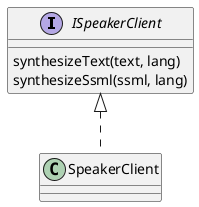

# Introduction

Speechee service API represents reliable C++ API.
This API is based on DBus communication and represented by simple C++ classes.

# Purpose

The main purpose of speechee service API is providing a reliable way to synthesize text into speech.

# Component Structure

## Software Units

| Name          | Description                                       |
|---------------|---------------------------------------------------|
| SpeakerClient | Represents an implementation of public API client |

## Class Diagrams

