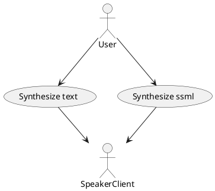
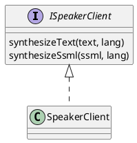

# Introduction

Client component represents an implementation of speaker service API.

# Purpose

The purpose is handling DBus communication between public API users and speaker component service
and wrapping all this stuff inside shared library with straightforward API.

# Use Cases

# Component Structure

## Software Units

| Name          | Description                                       |
|---------------|---------------------------------------------------|
| SpeakerClient | Represents an implementation of public API client |

## Class Diagrams

