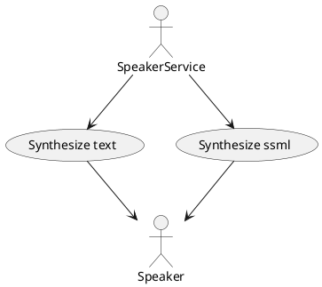
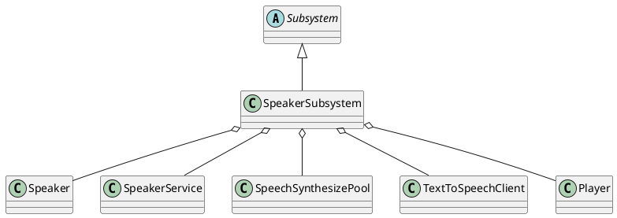
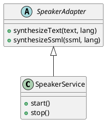
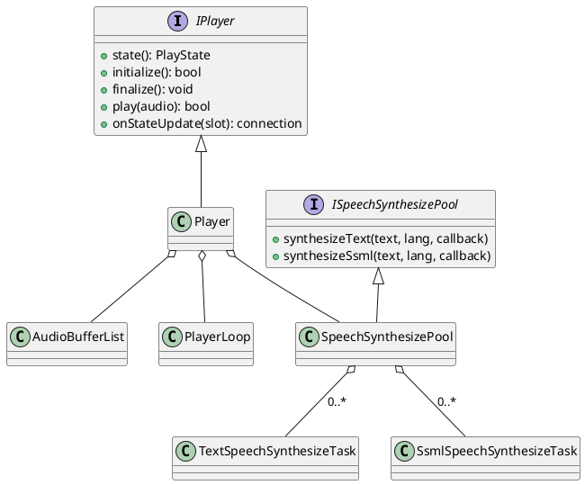
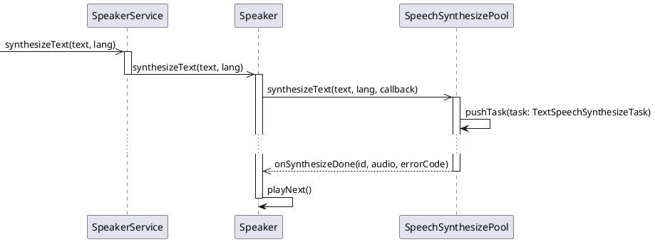
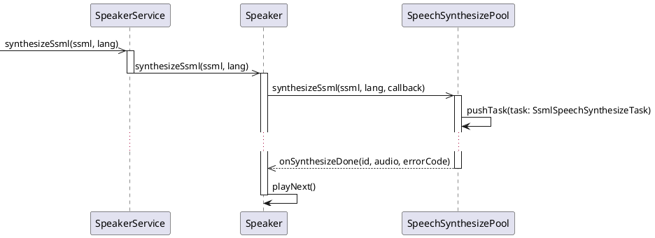
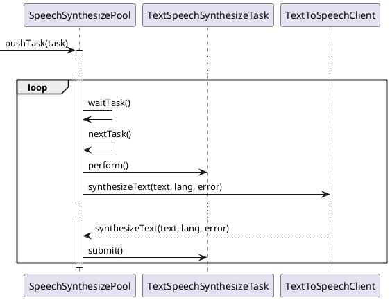

# Introduction

Speech component represents a main component of speaker service.

This component has two responsibilities:

* synthesizing readable text into human speech
* playing human speech using default audio device

# Purpose

The purpose is synthesizing readable text into human speech and further playing on audio device.

# Use Cases

* Synthesize text or ssml

# Component Structure

## Software Units

| Name                     | Description                                                                     |
|--------------------------|---------------------------------------------------------------------------------|
| Player                   | The player to play audio in WAV format on default audio device                  |
| PlayerLoop               | The player loop to handle GLib event loop using dedicated thread                |
| Speaker                  | The speaker to synthesize text to speech and play on player within single queue |
| SpeakerService           | The service to implement API using dbus underlying infrastructure               |
| SpeakerSubsystem         | The subsystem to handle lifetime of service software units                      |
| SpeechSynthesizePool     | The synthesize pool to handle synthesizing tasks                                |
| TextSpeechSynthesizeTask | The task to handle synthesizing text to speech                                  |
| SsmlSpeechSynthesizeTask | The task to handle synthesizing ssml to speech                                  |
| TextToSpeechClient       | The client to work with Google TTS online service                               |

## Class Diagrams

* Subsystem

* Service

* speaker

## Sequence Diagram

* Synthesize text

* Synthesize SSML

* Handle synthesizing text task

